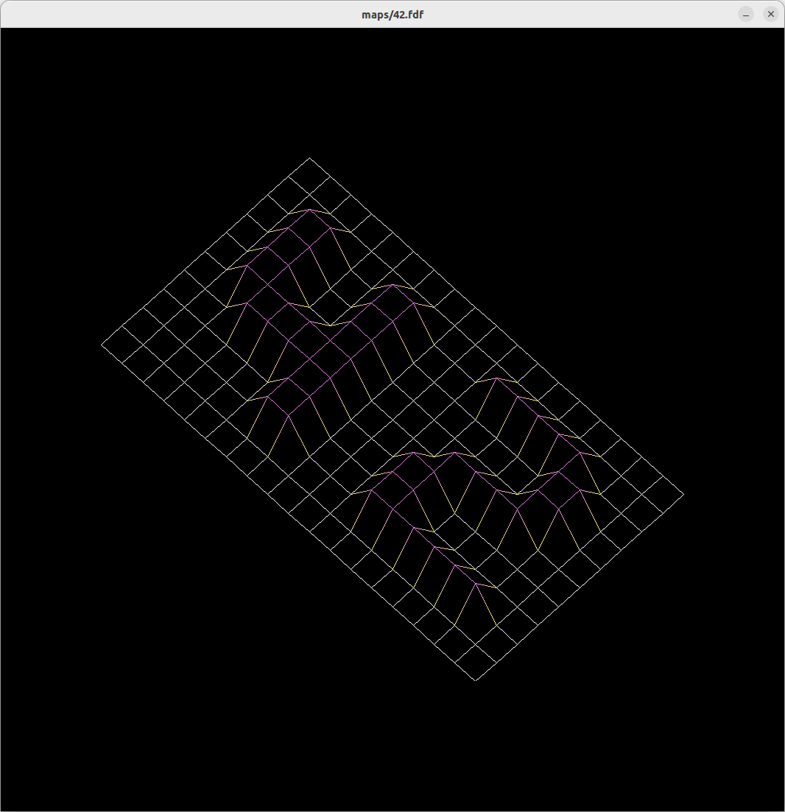
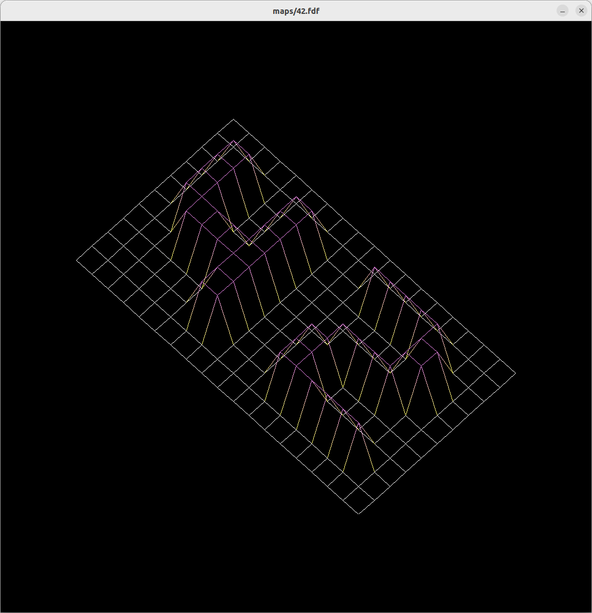
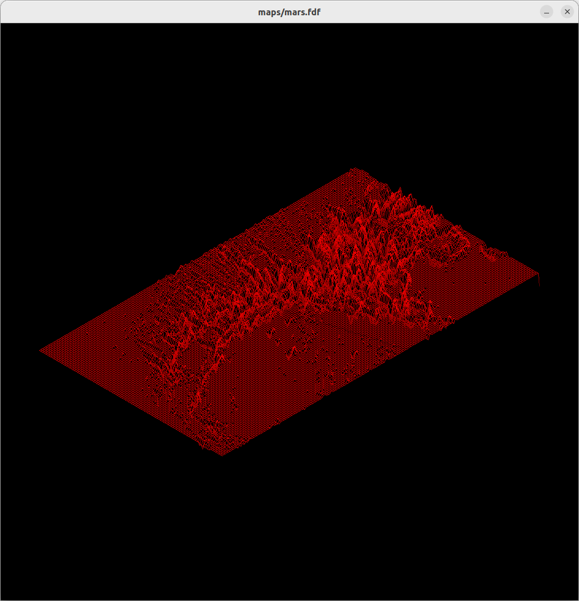
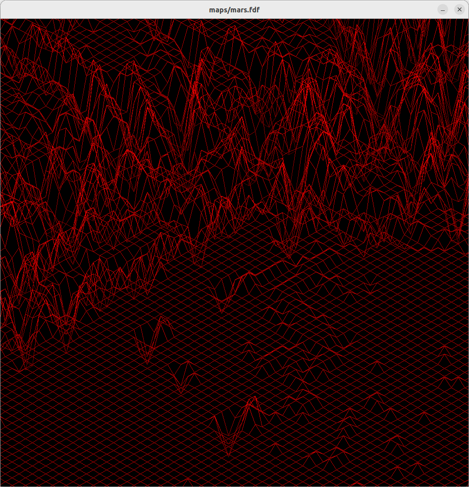
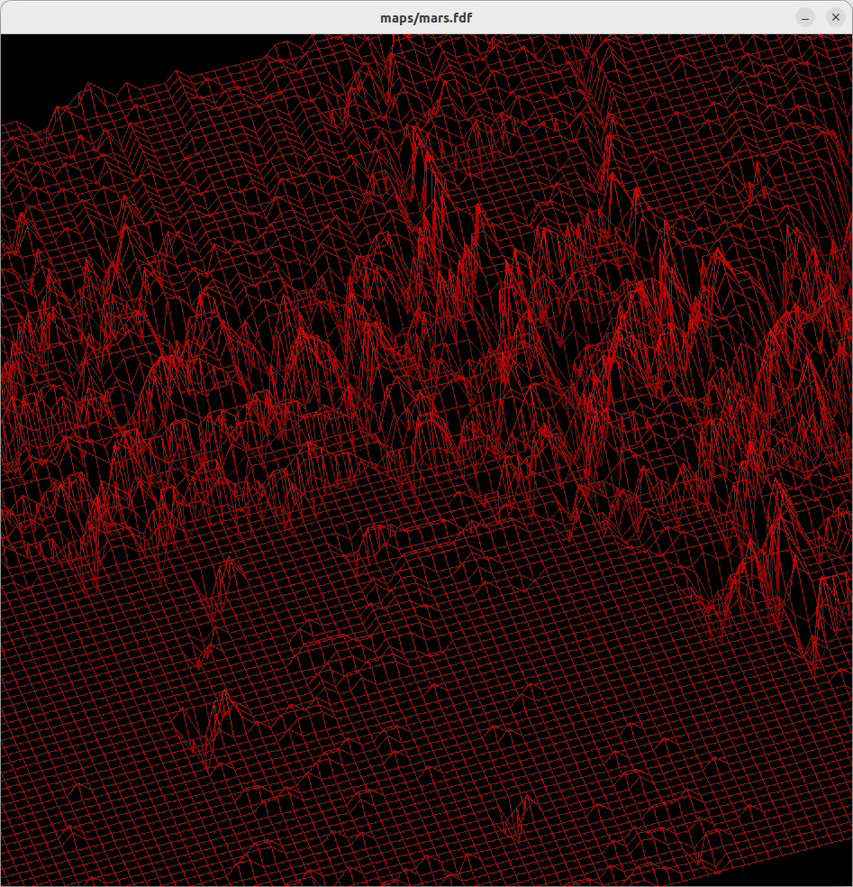
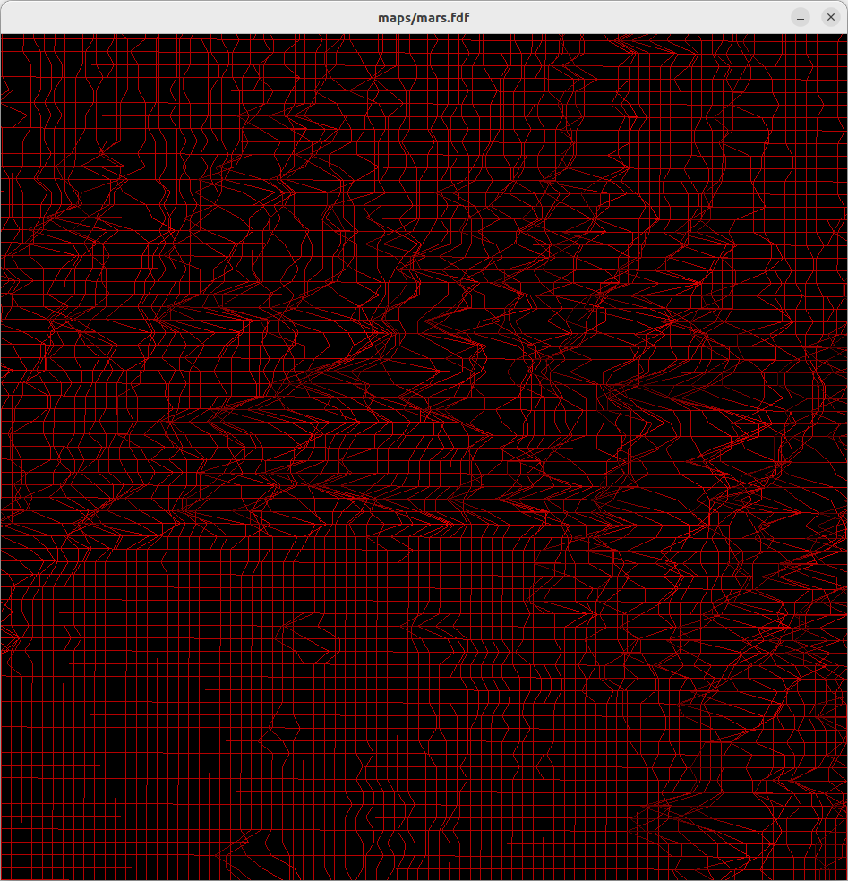
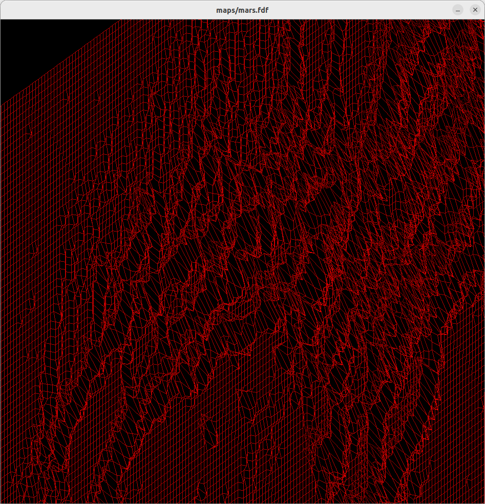
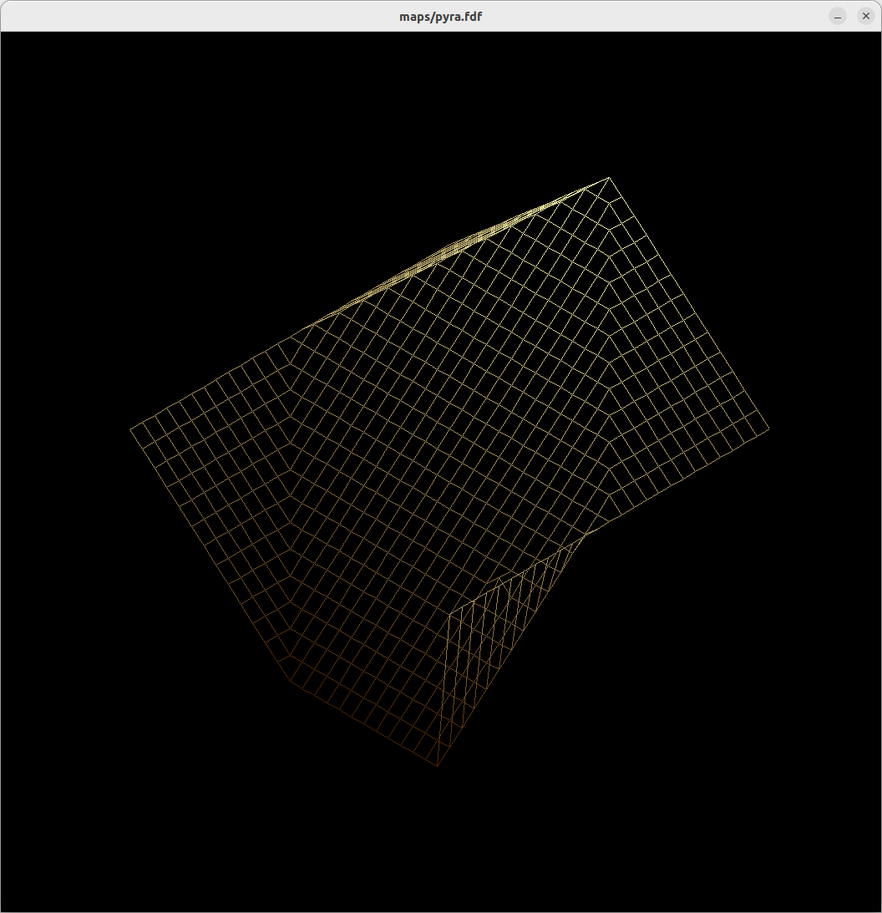
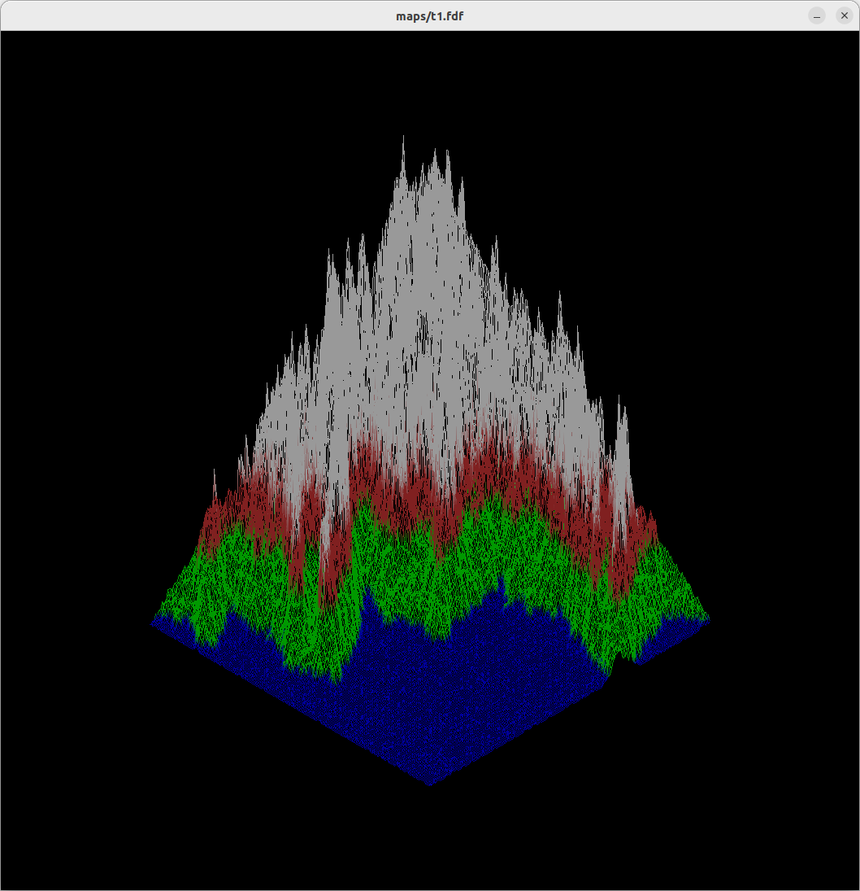

<div align="center">
  <h1>My fdf – Wireframe Renderer</h1>
  
  <br>
</div>


> **fdf** is a 3D wireframe map renderer built with **MiniLibX**.  
> It allows visualization of height maps (`.fdf` files) in **isometric projection** with zoom, rotation, and color gradients.

---

## 📖 Table of Contents
- [Description](#-description)
- [Features](#-features)
- [Installation](#-installation)
- [Usage](#-usage)
- [Examples](#-examples)
- [Roadmap](#-roadmap)
- [Credits](#-credits)
- [License](#-license)

---

## 📝 Description
`fdf` reads a map file (.fdf), containing elevation data, and displays it in a 3D wireframe using **MiniLibX**.  
This project introduces:  
- Graphics programming basics  
- Event handling (keyboard, mouse)  
- Isometric transformations  

---

## ✨ Features
- ✅ Load `.fdf` maps (2D arrays of integers).  
- ✅ Render wireframe in isometric projection.  
- ✅ Zoom in/out, translate and rotate the map.  
- ✅ Color gradients based on height.  

---

## ⚙️ Installation
Requirements:  
- Linux
- `make` and `gcc`/`clang`
- MiniLibX for Linux needs the dependencies `xorg`, `libxext-dev` and `zlib1g-dev`.

if needed you can install the MinilibX depencies with:
```bash
sudo apt-get update && sudo apt-get install xorg libxext-dev zlib1g-dev libbsd-dev
```
Then:
```bash
git clone https://github.com/LogUmi/fdf.git
cd fdf
make
```
This will generate an excutable fdf.

---

## 🖥 Usage
```bash
./fdf maps/<map filename.fdf>
```

Controls:  
- `Arrows` → Move map  
- `+`/ `-` → Zoom
- `7`/`4` → X axis rotation
- `8`/`5` → Y axis rotation
- `9`/`6` → Z axis rotation
- `1` `0` → increase / decrease Z scale 
- `SPACE` → Reset  
- `ESC` → Exit  

---

## 📂 Project Structure

```
.
├── img/                # Content for README
├── includes/           # Header files (.h)
├── libft/				# Authorized functions
├── maps/				# Contains map files
├── mlx_linux/			# MiniLibX library
├── srcs/               # Source code (.c)
├── LICENSE			    # License MIT & BSD
├── Makefile
├── memento.odt			# Memo minilibx and math.h
└── README.md
```

---

## 🔎 Examples

```bash
$ ./fdf maps/42.fdf
Special feature detected and applied
Loading map ... done
Applying this fdf colors defintion (no colors in map)
Screen 1920x1200 detected
Windows 1064x1064 opended
```


You can increase or decrease the Z scale:


```bash
Regular end of session on esc key press
```
Other screen outputs:



You can move, zoom and rotate the wireframe toard every axis:












---

## 🚀 Roadmap
There's no further modification in sight at this time.

---

## 👤 Credits
Project developed by **Loïc Gérard** – 📧 Contact: lgerard@studend.42perpignan.fr - [École 42 Perpignan](https://42perpignan.fr).

---

## 📜 License
- The project code (FdF, MiniRT, etc.) is released under the MIT License.
- The included MiniLibX library is released under the BSD License (© Olivier Crouzet, 1999–2015).
Both licenses are provided in the [LICENSE](./LICENSE) file of this repository.

> ⚠️ **Note for students**  
> If you are a student at 42 (or elsewhere), it is strongly recommended **not to copy/paste** this code.  
> Instead, try to **write your own solution** — it’s the only way to really learn and succeed.
